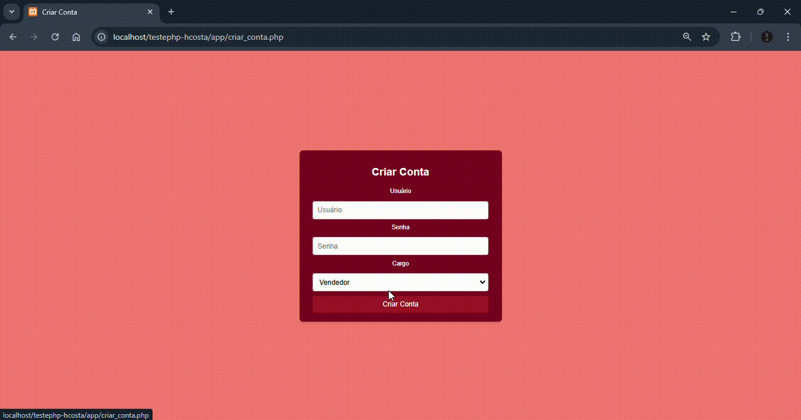
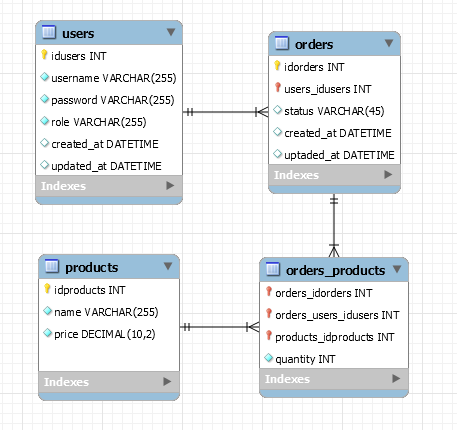

# DOCUMENTAÇÃO TESTEPHP-HCOSTA

## Descrição

Este projeto é a resolução do desafio do processo seletivo para a vaga de programador PHP/Laravel na empresa HCOSTA. 

Consiste na implementação uma aplicação Web utilizando o framework PHP Laravel, e o banco de dados relacional, desenvolvendo em um ambiente Docker.

**Tecnologias:** Docker, Laravel, PHP, HTML, CSS, Javascript, MySQL

- Data de Início: `02/12/2024`
- Data de Conclusão: `04/12/2024`

Confira o Desafio: [Arquivo-TestePHP.pdf](https://github.com/alanaqueiroz/testephp-hcosta/blob/main/README/Arquivo-TestePHP.pdf)

---

## Demo

Demonstração do projeto funcionando. Exibição da tabela com os dados do banco, logado como cliente, e demonstração das permissões:



---

## Estrutura do Projeto

Aqui está a estrutura de pastas e a explicação de suas funções:

```
/testephp-hcosta
├── app/
│   ├── service.pecas (API REST Laravel)
│   ├── Services/ 
│   │   └── ProductService.php (Configuração Url de consulta de item)
│   ├── criar_conta.php (Criar um nova conta)
│   ├── editar_pedido.php (CRUD: Tela excluir o pedido)
│   ├── editar_pedido.php (CRUD: Tela editar o status)
│   ├── login.php (Tela de login)
│   ├── logout.php (Deslogar)
│   ├── pedidos.php (Exibição de pedidos realizados)
│   ├── produtos.php (Exibição dos 20 produtos disponíveis)
├── docker/
│   ├── nginx/
│   │   └── default.conf
│   ├── php/
│   │   └── Dockerfile
│   ├── docker-compose.yml
├── README/ (Arquivos da documentação)
├── README.md (Documentação)
├── .env (Acesso ao banco)
├── banco.sql (Comandos SQL para criação do Banco de Dadados)
├── docker-compose.yml (Estruturação containers)
└── modelagem.mwb (Modelagem do banco por MySQL Workbench)
```

### Detalhes dos Arquivos

1. **docker-compose.yml**  
   Arquivo principal para gerenciar os contêineres. Deve incluir:
   - Um serviço para PHP
   - Um serviço para Nginx
   - Um serviço para MySQL
   - Um serviço para phpMyAdmin

2. **Dockerfile** (dentro de `docker/php/`)  
   Define o ambiente do PHP. Adicione extensões como `pdo_mysql`, `mbstring`, etc.

3. **default.conf** (dentro de `docker/nginx/`)  
   Configuração do Nginx para servir a aplicação Laravel.

---

## Modelagem de Dados

Representação da estrutura de um sistema de vendas. Ele permite gerenciar usuários, pedidos e produtos, além de relacionar pedidos a produtos específicos.

### Modelo Conceitual
DER (Diagrama Entidade-Relacionamento)



 O Arquivo do modelo conceitual desenvolvido no [MySQL WorkBench](https://dev.mysql.com/downloads/workbench/), se encontra na pasta princiapl do projeto com o titulo `modelagem.mwb`

### Modelo Lógico

#### 1. **Tabela `users`**
Armazena informações sobre os usuários do sistema.

- **Campos:**
  - `id`: Identificador único do usuário (chave primária).
  - `username`: Nome de usuário único.
  - `password`: Senha do usuário.
  - `role`: Papel do usuário (`cliente` ou `vendedor`).
  - `created_at`: Data de criação do registro.
  - `updated_at`: Data da última atualização do registro.

#### 2. **Tabela `orders`**
Armazena informações sobre os pedidos realizados pelos clientes.

- **Campos:**
  - `id`: Identificador único do pedido (chave primária).
  - `user_id`: Identificador do usuário que realizou o pedido (chave estrangeira).
  - `status`: Status do pedido (`pendente`, `pago`, `finalizado`).
  - `created_at`: Data de criação do pedido.
  - `updated_at`: Data da última atualização do pedido.

- **Relacionamento:**
  - Relacionado à tabela `users` via `user_id`.
  - **Restrição:** `ON DELETE CASCADE` - Exclui os pedidos se o usuário for removido.

#### 3. **Tabela `products`**
Armazena os produtos disponíveis para venda.

- **Campos:**
  - `id`: Identificador único do produto (chave primária).
  - `name`: Nome do produto.
  - `price`: Preço do produto.

#### 4. **Tabela `order_products`**
Relaciona pedidos com produtos específicos, permitindo que um pedido tenha múltiplos produtos e quantidades.

- **Campos:**
  - `order_id`: Identificador do pedido (chave estrangeira).
  - `product_id`: Identificador do produto (chave estrangeira).
  - `quantity`: Quantidade de um produto específico no pedido.

- **Relacionamento:**
  - Relacionado à tabela `orders` via `order_id`.
  - Relacionado à tabela `products` via `product_id`.
  - **Restrição:** `ON DELETE CASCADE` - Exclui os relacionamentos se o pedido ou produto for removido.

### Modelo Físico

```
CREATE DATABASE sistema_vendas;

-- Tabela de Usuários
CREATE TABLE users (
    id INT AUTO_INCREMENT PRIMARY KEY,
    username VARCHAR(255) NOT NULL UNIQUE,
    password VARCHAR(255) NOT NULL,
    role ENUM('cliente', 'vendedor') NOT NULL,
    created_at TIMESTAMP DEFAULT CURRENT_TIMESTAMP,
    updated_at TIMESTAMP DEFAULT CURRENT_TIMESTAMP ON UPDATE CURRENT_TIMESTAMP
);

-- Tabela de Pedidos
CREATE TABLE orders (
    id INT AUTO_INCREMENT PRIMARY KEY,
    user_id INT NOT NULL,
    status ENUM('pendente', 'pago', 'finalizado') DEFAULT 'pendente',
    created_at TIMESTAMP DEFAULT CURRENT_TIMESTAMP,
    updated_at TIMESTAMP DEFAULT CURRENT_TIMESTAMP ON UPDATE CURRENT_TIMESTAMP,
    FOREIGN KEY (user_id) REFERENCES users(id) ON DELETE CASCADE
);

-- Tabela de Produtos (opcional apenas como historico se quiser salvar produtos localmente)
CREATE TABLE products (
    id INT AUTO_INCREMENT PRIMARY KEY,
    name VARCHAR(255) NOT NULL,
    price DECIMAL(10, 2) NOT NULL
);

-- Tabela de Produtos (EXTERNO: criar dentro da API REST)
CREATE TABLE produtos (
    id_produto INT AUTO_INCREMENT PRIMARY KEY,
    nome VARCHAR(255) NOT NULL,
    descricao TEXT,
    preco DECIMAL(10, 2) NOT NULL,
    estoque INT NOT NULL DEFAULT 0,
    categoria VARCHAR(255),
    data_criacao DATETIME DEFAULT CURRENT_TIMESTAMP,
    data_atualizacao DATETIME DEFAULT CURRENT_TIMESTAMP ON UPDATE CURRENT_TIMESTAMP
);

-- Tabela de Produtos dos Pedidos
CREATE TABLE order_products (
    order_id INT NOT NULL,
    product_id INT NOT NULL,
    quantity INT NOT NULL CHECK (quantity > 0),
    PRIMARY KEY (order_id, product_id),
    FOREIGN KEY (order_id) REFERENCES orders(id) ON DELETE CASCADE,
    FOREIGN KEY (product_id) REFERENCES products(id) ON DELETE CASCADE
);
```
O arquivo SQL do **Modelo Físico**, se encontra nas dependências do projeto ([banco.sql](https://github.com/alanaqueiroz/testephp-hcosta/blob/main/banco.sql)).

---

## Acesso ao projeto

### 1. Requisitos: 

Para rodar o projeto, certifique-se de ter os seguintes softwares instalados em sua máquina:

1. **Docker**  
   Instale o Docker de acordo com seu sistema operacional:  
   - [Docker Desktop](https://www.docker.com/products/docker-desktop) (Windows/Mac)  
   - [Docker Engine](https://docs.docker.com/engine/install/) (Linux)

2. **Docker Compose**  
   Certifique-se de que o Docker Compose está instalado (normalmente incluído no Docker Desktop).  
   Verifique a instalação executando:
   ```bash
   docker-compose --version
   ```

3. **Composer** (opcional para criar o projeto Laravel localmente antes de usar o Docker)  
   Instale o Composer seguindo as instruções no [site oficial](https://getcomposer.org/).

#### Para rodar o projeto, siga os passos a seguir:

### 2. Clone o Repositório

Clonar o projeto:
```bash
git clone https://github.com/alanaqueiroz/testephp-hcosta.git
cd testephp-hcosta
```
### 3. Suba os Contêineres

Execute o seguinte comando na raiz do projeto:
```bash
docker-compose up -d
```

### 4. Crie o banco de dados

No diretório principal desse projeto, o arquivo SQL [banco.sql](https://github.com/alanaqueiroz/testephp-hcosta/blob/main/banco.sql), contem os comandos necessarios para criar o banco. Para criar o banco, rode os comandos em um gerenciador de banco de dados da sua preferência. Exemplo: [MySQL-Front](https://mysql-front.software.informer.com/download/).

Caso opte por gerar o banco pelo phpMyAdmin, ele fica disponível `localhost:8888`, conforme a porta configurada do arquivo `docker-composer.yml`.

### 5. Rodando o Projeto

- Servidor Local: Você pode visualizar o projeto em um servidor local, por exemplo o [XAMPP](https://www.apachefriends.org/download.html), colocando a pasta do projeto dentro da pasta `htdocs` e acessar a url `http://localhost/testephp-hcosta/app/login.php`. 
- Ou se preferir é possível acessar o projeto pela porta `8585` configurada no ngix do `docker-compose.yml`

---

## Solução de Problemas

1. **Erro de permissões no diretório `storage` ou `bootstrap/cache`**  
   Dentro do contêiner PHP, execute:
   ```bash
   chmod -R 775 storage bootstrap/cache
   chown -R www-data:www-data storage bootstrap/cache
   ```

2. **Problemas ao instalar pacotes com Composer**  
   Certifique-se de estar no contêiner PHP:
   ```bash
   docker exec -it laravel-app bash
   composer install
   ```
   
   Caso veja que o composer não está sendo instalado, verifique se o diretório php esta configurado nas Variáveis do Sistema. Se estiver e mesmo assim continuar, verifique se a versão do Laravel é compatível com seu PHP via terminal:
   ```bash
   php -v
   ```

---

## Registro

Aqui deixo um registro das etapas que realizei durante o desenvolvimento do projeto:

### 1. Criação do ambiente Docker

### 2. Estruturação e criação do servidor `nginx` na pasta `Docker`

Criação do arquivo `docker/nginx/default.conf` certificando que as páginas de início index eram o `login.php` (Meu arquivo inicial)

```nginx
server {
    listen 80;
    index login.php login.html;
    root /var/www/html/public;

    location / {
        try_files $uri $uri/ /login.php?$query_string;
    }

    location ~ \.php$ {
        include fastcgi_params;
        fastcgi_pass app:9000;
        fastcgi_index login.php;
        fastcgi_param SCRIPT_FILENAME $document_root$fastcgi_script_name;
    }

    location ~ /\.ht {
        deny all;
    }
}
```

### 3. Configuração e estruturação do PHP da pasta `Docker` para consumir imagens Docker 

### 4. Configuração do `.env` para o banco que estou usando:

```nginx
DB_DATABASE=sistema_vendas
DB_USERNAME=root
DB_PASSWORD=root
```

### 5. Mapeamento de portas no docker-compose.yml

- Um serviço para PHP
- Um serviço para Nginx
- Um serviço para MySQL
- Um serviço para phpMyAdmin

### 6. Subindo as imagens Docker 

```bash
docker-compose up -d
```

### 7. Tratamento de Dados

- Modelo Conceitual: Foi feito utilizando [MySQL WorkBench](https://dev.mysql.com/downloads/workbench/).
- Modelo Lógico: criado no gerenciado de banco de dados MySQL-Front.
- Criação do banco de dados no [MySQL-Front](https://mysql-front.software.informer.com/download/).

### 8. Desenvolvimento das telas em PHP

### 9. Criação das operações CRUD

CRUD de Clientes: Criar, alterar, deletar e listar

CRUD de pedido: Criar, alterar, deletar e listar

- **Criar**: (Na tela `produtos.php`, ao selecionar os produtos que deseja comprar, e clicar no botão "Fazer Pedido", gera um novo pedido na pagina `pedidos.php`). 
- **Deletar**: (Na tela `pedidos.php`, ao cliclar no potão deletar em um pedido, ele é excluído)
- **Alterar**: (Na tela `pedidos.php`, ao cliclar no botão "Alterar Status" no pedido com status Pendente, vai para a pagina `editar_pedido.php`, onde é possível alterar seu status). 
- **Listar**: (Na tela `produtos.php`, há uma paginação de 20 produtos filtráveis e ordenáveis).

### 10. Aplicação do conceito Clean Code

Foi aplicado o conceito em todas as telas PHP

- **Nomes**: Foram usados nomes significativos nas variáveis, funções e classes, refletindo seu propósito claramente.
- **Legibilidade**: O código possui uma arquitetura facilmente compreensível.
- **Comentários**: Foram realizados comentários esclarecedores nos códigos.
- **Formatação**: Código uniforme de forma identada e com espeçamentos, facilitando a leitura.

### 11. Utilização do XAMPP

Para verificar o funcionamento das telas, utilizei o servidor local [XAMPP](https://www.apachefriends.org/download.html).